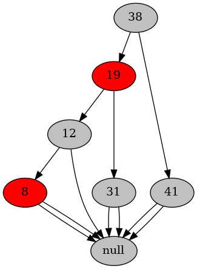

# 数据结构与算法I 作业11

**2019201409 于倬浩**

## 13.3-2

第六次上机实验中，实现了支持插入的红黑树以及实时可视化功能，以下为程序输出：

## 13.3-4

在`fixup`部分中，我们有两种情况会把某个节点由黑变红：

+ 如果当前点`x`为红色，且当前点的父亲`f`和当前点的叔叔`u`同时为红，则会把`z`的祖父设为红色。然而这种情况下，z的祖父一定不是`NIL`，即z的父亲节点一定不是根，否则z不存在叔叔`u`。
+ 如果当前点`x`为红色，当前点的父亲`f`为红色，当前点的叔叔`u`为黑色，则根据红黑树的性质，当前点的祖父也为黑色。此时会把祖父设为红色后进行旋转。如果当前点的祖父为`NIL`，则当前点的父亲`f`实际上是树根，而且还是红色，很明显违背了红黑树的性质，即当前点的祖父并不可能是`NIL`，因此不会把`NIL`改成红色。