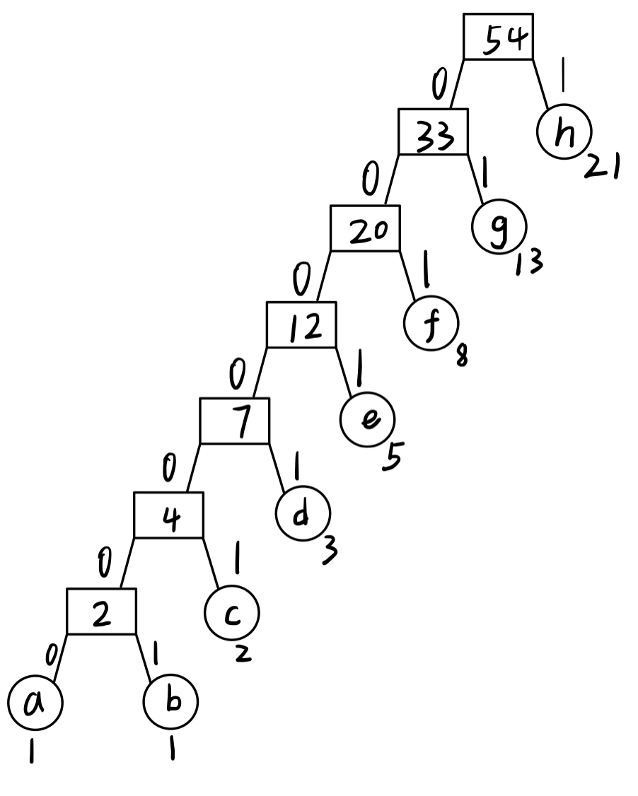

# 数据结构与算法I 作业16

## 16.3-3



如图所示，每个字符对应哈夫曼编码如下：

| Character | Huffman   |
| --------- | ---------:|
| a         | `0000000` |
| b         | `0000001` |
| c         | `000001` |
| d         | `00001` |
| e         | `0001` |
| f         | `001` |
| g         | `01` |
| h         | `1` |

因此，如果字母表中共有`n`个字符，且对应斐波那契数列的前`n`项，那么第`1`个字母对应`n`个`0`，第`i+1`个字母对应`n-i`个`0`以及末尾的一个`1`。


## 16-2

+   a.

    +   算法：将n个任务按照$p_i$从小到大排序，然后依次执行即可（即贪心地执行剩余任务中耗时最短的）。

        时间复杂度取决于排序算法的时间复杂度，因此为$\Theta(nlgn)$。

    +   证明：首先考虑最优子结构。如果我们先将耗时最短的任务放在第一个，那么只有一个子问题，即在剩下的`n-1`项任务中选出最优的决策序列，而第一个决策已经不必更改，必定出现在最终的最优解里，因此满足最优子结构。接下来考虑当前有任意一个最优解$S$以及我们通过上述贪心策略构造出的解$S'$。那么分别取两个决策的第一个决策为$a, b$，如果$a \ne b$，就在$S$中交换两个元素的位置。根据贪心策略，有$b \leq a$，因此，在$S$中交换两个元素的位置，可使总时间减少$(p_a - p_b) * (pos(b) - pos(a))$，即在决策序列S中夹在两个元素之间的每个任务都减少了$p_a - p_b$的时间，答案不会变劣，因此贪心调整的正确性得证。

        

+   b.

    +   算法：考虑拓展a中的算法。大致思路是，按照不同的`release time`划分阶段。对于每个阶段，将所有可用的任务按照a的贪心策略排列，直到所有可用的任务都被分配，或是当前时间已经用尽但是还剩下一些任务没有完成，将当前没有做的任务以及正在做但是没做完的任务放到下一个阶段继续处理。
    +   具体实现是，维护一个小根堆，枚举第`i`批任务的`Release time` $R_i$，将所有在该时刻放出的任务加入堆中，每次取出堆顶（即当前可用的最小耗时的任务）并计入时间，如果距离下一个`Release Time`还有时间且还有未完成的任务，则继续分配下一个任务；如果当前任务所需时间大于本阶段剩余时间，则将剩下的时间作为一个新的未完成任务，加入下一批任务。接下来，对下一批任务进行相同的处理即可。

    +   假设有$m$个非空的`Release Time`，以及$n$个任务，由于每个元素都会入堆、出堆各一次，且每个时刻至多会带来一次的入堆和出堆，因此实际上有$\Theta(n+m)$次堆的入堆出堆操作，因此这部分带来的时间复杂度为$\Theta((n+m)lg(n+m))$，且最坏情况下，非空的时刻数$m$不会超过$n$，因此可以认为$n、m$同阶，即时间复杂度为$\Theta(nlgn)$。另外还需要对每个任务进行遍历，以及对`Release Time`排序，对于每个`Release Time`存储该时刻加入的任务，因此还有额外的$\Theta(mlgm+n)$的时间、$\Theta(n+m)$的空间。

    +   因此，算法的总时间复杂度为$\Theta((n+m)lg(n+m))$，空间复杂度$\Theta(n+m)$，且最坏情况下，$m$不会超过$n$（因为最坏情况下每个任务都有不同的`Release Time`），因此最坏时间复杂度$\Theta(nlgn)$。

    +   贪心正确性证明：对于每个阶段内的决策，实际上都是a中问题的子问题，因此每个阶段内的贪心正确性已经得证，而每个阶段还没有做的任务必定要在以后的某个阶段中被完成，因此直接放到下个阶段中进行考虑，不会减少剩下的任务被考虑到的机会，因此也不会使答案变劣。即这样的调整策略就是最优的。

    +   下面给出C++代码：

        

```c++
struct ReleaseTime{
    int t; //当前时刻
    vector<int> tasks; //时刻对应放出的任务集合
    inline bool operator < (const ReleaseTime &b) {
        return t < b.t; //按照时间从小到大排序
    }
};

const int inf = ~(1 << 31);

inline double solve(vector<ReleaseTime> rt) {
    sort(rt.begin(), rt.end());
    priority_queue<int, vector<int>, greater<int> > pq; //小根堆
    int currentTime = rt[0].t, totalTime = 0;
    for(int i = 0; i < rt.size(); ++i) { //按照Release Time划分阶段
        int curStageRemainingTime; //当前阶段剩余时间
        if(i < rt.size() - 1) 
            curStageRemainingTime = rt[i + 1].t - rt[i].t;
        else 
            curStageRemainingTime = inf;
        for(auto j:rt[i].tasks) //放出当前时刻可用的任务
            pq.push(j);
        while(!pq.empty() && curStageRemainingTime > 0) { 
            //贪心地取任务
            int c = pq.top();
            pq.pop();
            if(c <= curStageRemainingTime) {
                curStageRemainingTime -= c;
                currentTime += c;
                totalTime += currentTime;
            }
            else {
                c -= curStageRemainingTime;
                currentTime += curStageRemainingTime;
                curStageRemainingTime = 0;
                pq.push(c);
                break;
            }
        }
    }
    return 1.0 * totalTime / rt.size();
}
```

