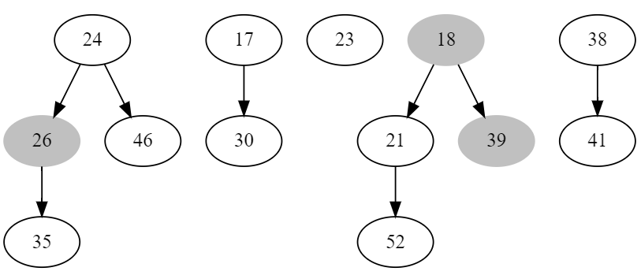
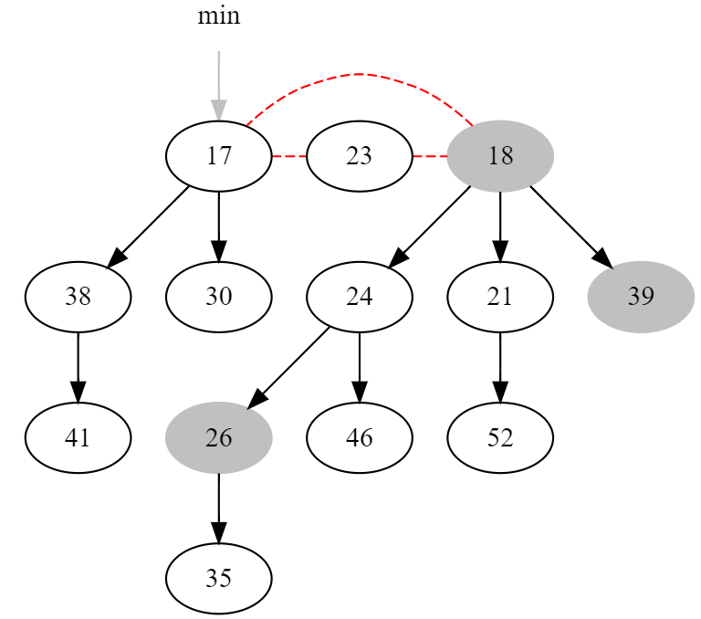

# 数据结构与算法I 作业18

**2019201409 于倬浩**

## 17-1

+   a.

    ```c++
    void revArray(int a[], int n) {
        for(int i = 0; i < n; ++i)
            a[i] = rev(i);
    }
    ```

    直接枚举每个数，调用$\Theta(k)$的`rev()`计算，总时间复杂度$\Theta(nk)$。

    

+   b.

    ```c++
    const int W = 32;
    inline int bitReversedIncrement(int k) {
        for(int i = W - 1; i >= 0; --i) {
            k ^= 1 << i;
            if(k & (1 << i) == 1) 
                break;
        }
    }
    void revArray(int a[], int n) {
        a[0] = 0;
        for(int i = 1; i < n; ++i)
            a[i] = bitReversedIncrement(a[i - 1]);
    }
    ```

    只需模拟加法器，将从最高位到最低位连续的一段1置为0，再将最后一个0置为1即可。

    该过程执行的操作和普通的加法器除了运算下标外完全相同，势能分析的过程除了从高位开始外也完全相同，因此执行`revArray`的总运行时间$T(n) = O(n)$，单次执行`bitReversedIncrement`的均摊代价为$O(1)$。

+   c.

    ```c++
    void revArray(int a[], int n) {
        int h = 1 << 31;
        a[0] = 0;
        for(int i = 1; i < n; ++i) {
            a[i] = a[i >> 1] >> 1;
            if(i & 1) a[i] = a[i] | h;
        }
    }
    ```

    考虑使用递推的方法计算`a[i]`。

    我们在计算`a[i]`时，实际上`a[i >> 1]`已经被计算出（从小到大枚举，$i > \lfloor \frac{i}{2} \rfloor$），因此可以使用`a[i >> 1]`推算出`a[i]`。由于`i >> 1`仅由`i`右移一位，因此`a[i]`也只需由`a[i >> 1]`右移一位，再根据`i`的最低位决定`a[i]`的最高位为0/1即可。计算过程中仅需两次右移1位操作以及一次按位或。最高位可以通过预处理1左移`W`位的结果得到，避免每次再计算最高位为1其余全0的常数。


## 19.2-1

首先，最小值对应堆中的节点7，因此删去7后，将7的所有儿子放到根链表中：



接下来·，合并相同度数的节点，结果如下：



其中红色的边表示根双向链表中的连接关系，灰色节点表示被标记。