# 数据结构与算法I 作业21

**2019201409 于倬浩**

## 18.2-1

插入Q：

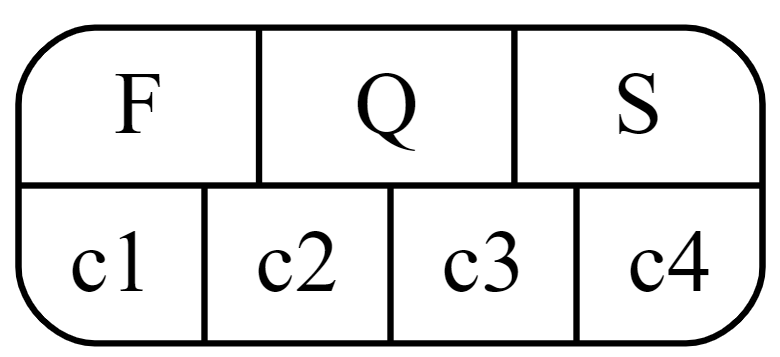

插入K：

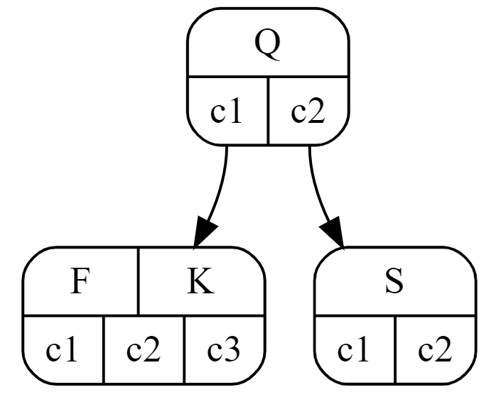

插入C：

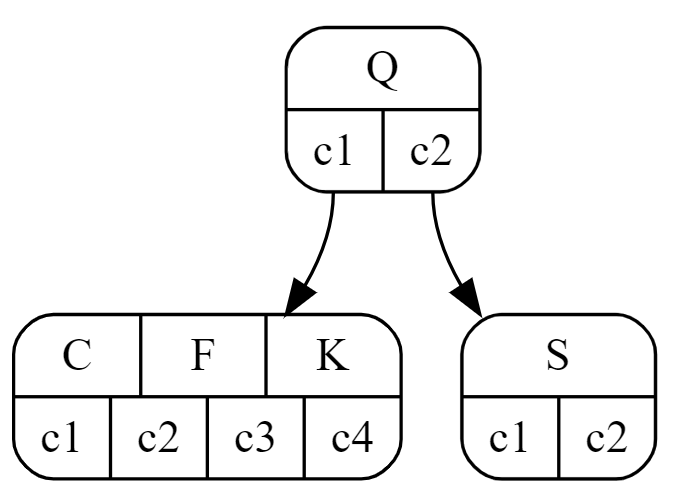

插入L：

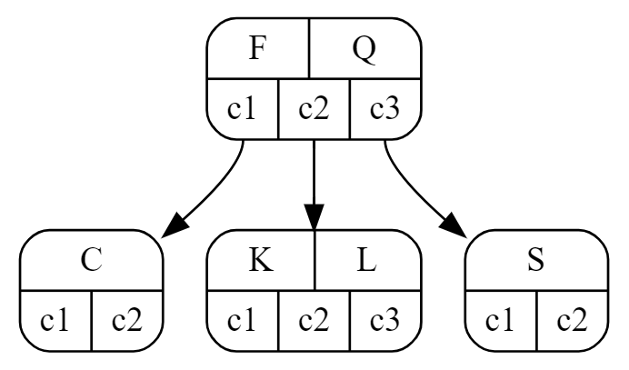

插入V后：

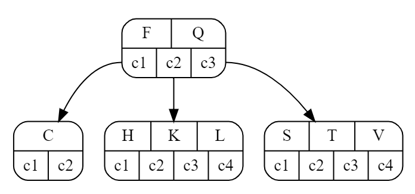

插入W后：

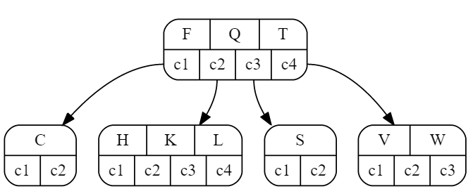

插入M前（分裂）：

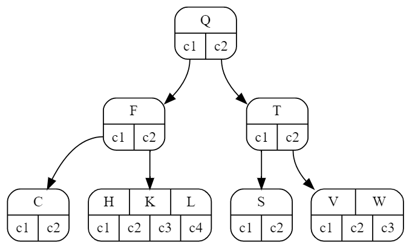

插入M后：

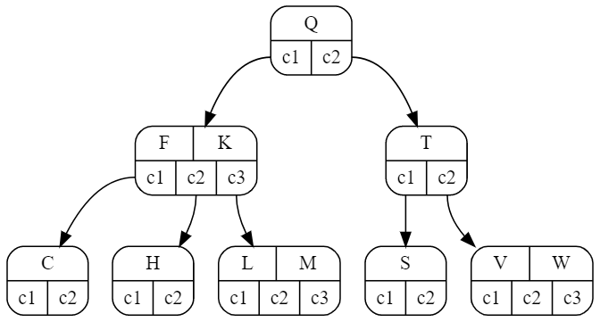

插入P后：

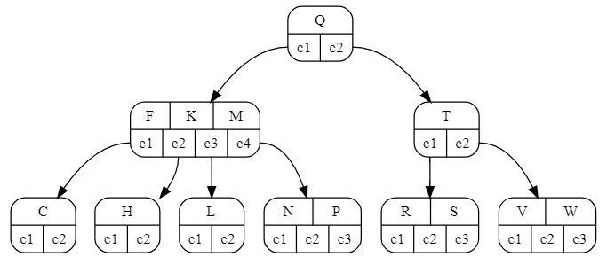


插入A前（分裂）：

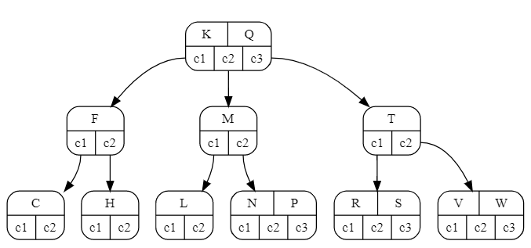

插入Y前（分裂）：

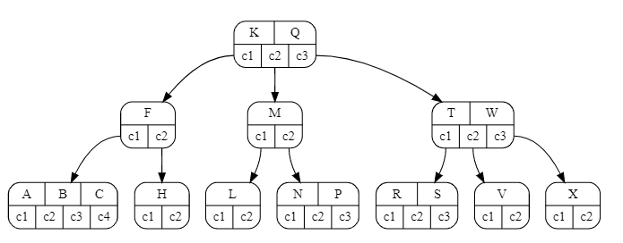

最终结果：

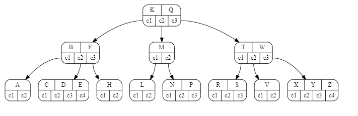


## 18.3-2

```c++
void B_Tree_Delete(Node *x, int k) {
    B_Tree_Read(x);
    if(x->leaf == true) 
        delete x->key[k];
    else {
        if(k in x->key[]) {
            node *&y = find_predecessor(x, k), *&z = find_successor(x, k);
            node *kk = find_child(x, k);
            if(y->size >= t) {
                node *yy = find_predecessor(y, k);
                B_Tree_Delete(yy, k);
                y = yy;
            }
            else {
                if(z->size >= t) {
                    node *zz = find_successor(z, k);
                    B_Tree_Delete(zz, k);
                    z = zz;
                }
                else {
                    if(z->size + y->size == 2*t - 1) {
                        merge(y, kk, z);
                        x->key[].erase(kk), x->key.erase(z);
                        B_Tree_Delete(y, k);
                    }
                }
            }
        }
        else {
            node *xk = Find_K_recursively(x, k), *xkf = xk;
            node *last = Find_father_of_xk(x, k);
            if(xk->size == t - 1 && (xk->left->size >= t || xk->right->size >= t)) {
                xk->key.insert(last);
                if(xk->left->size >= t) x->key.insert(xk->left);
                else x->key.insert(xk->right);
            }
            if(xk->size == t - 1 && xk->left->size == t - 1 && xk->right->size == t - 1) {
                merge(xk->left, last, xk);
            }
            B_Tree_Delete(last, k);
        }
        
    }
    B_Tree_Write(x);
}
```

