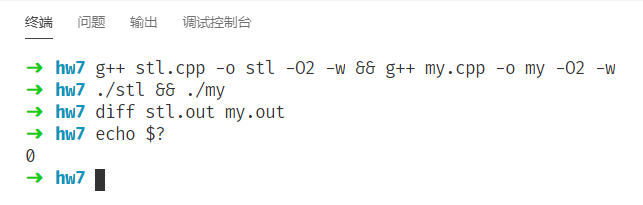

# 数据结构与算法I 作业7

**2019201409 于倬浩**

## 10.1-5

```c++
struct My_Deque{
    int s[maxn], size, qh, qt;
    //分别为数据，大小，队首，队尾。
    My_Deque() {
        size = 0;
        qh = 0, qt = 0;
    }
    inline void push_front(int x) {
        ++size;
        if(size > maxn) throw std::out_of_range("Too many elements.");
        qh = qh - 1;
        if(qh < 0) qh += maxn;
        s[qh] = x;
    }
    inline void push_back(int x) {
        ++size;
        if(size > maxn) throw std::out_of_range("Too many elements.");
        s[qt++] = x;
        if(qt == maxn) qt = 0;
    }
    inline void pop_front() {
        --size;
        if(size < 0) throw std::out_of_range("Dequeue is already empty.");
        ++qh;
        if(qh >= maxn) qh = 0;

    }
    inline void pop_back() {
        --size;
        if(size < 0) throw std::out_of_range("Dequeue is already empty.");
        --qt;
        if(qt < 0) qt += maxn;
    }
    inline const int front() {
        if(size <= 0) throw std::out_of_range("Dequeue is empty.");
        return s[qh];
    }
    inline const int back() {
        if(size <= 0) throw std::out_of_range("Dequeue is empty.");
        if(qt > 0) return s[qt - 1];
        else return s[maxn - 1];
    }
};
```

该程序已经和`std::deque`进行对拍，测试通过。


## 10-2

1. 对于原本有序的链表，`MAKE-HEAP`按照定义只需创建一个空的链表，时间复杂度$\Theta(1)$；`INSERT(x)`，可以从表头开始遍历链表，直到当前指针指向的下一个元素为空或是大于`x`，则将`x`插入在链表中当前元素之后，时间复杂度$\Theta(n)$；`MINIMUM(x)`，直接返回链表表头指向的元素，时间复杂度$ \Theta(1) $；`UNION(a,b)`，在`a`中线性遍历，直到当前元素指向的下一个元素严格大于`b`的表头元素。接下来，二路归并两个链表即可得到一个有序的链表。时间复杂度$\Theta(n+m)$，其中n、m分别为a、b的大小。 
2. 不是很理解b、c的题意。如果题目要求的是，强制我维护一个无序的链表，实现堆的操作，那么有两种做法：
    + A: 每次插入新的元素就直接插到队首，提取最小值就在链表中线性扫描一遍，找到最小值并删除，返回结果。合并时对每个链表分别使用插入排序，然后二路归并。插入时间复杂度$\Theta(1)$，提取$\Theta(1)$，合并$\Theta(n^2+m^2)$。
    + B: 将链表视为一个数组，在链表上实现二叉堆的各种操作。`INSERT(x)`，从表头开始遍历数组，找到第一个大于x的位置，然后将该位置的值设为x，接下来由于二叉堆的一条根到叶子的路径上节点下标总是单调递增的，因此只需要线性定位到儿子的下标、类似二叉堆插入式地迭代即可，若不存在大于x的位置，直接插入到链表尾部，时间复杂度$\Theta(n)$，而且无法降低（链表只支持顺序访问不支持随机访问）。`MINIMUM(x)`返回链表表头指向的元素，并利用二叉堆从上向下调整堆性质的方法维护该堆的性质，然而由于定位子节点依旧需要线性遍历寻址，因此时间复杂度$\Theta(n)$。`UNION(a,b)`维护一个单调指针，遍历表a，接下来利用堆的单调性质，每次在b中取堆顶元素，改变a中单调指针的位置，直到下个元素为空或大于当前b的堆顶，然后和`insert`一样插入并维护堆性质即可。单调指针保证每个元素只被扫描一次，虽然单次维护堆性质最坏需要$\Theta(n)$次迭代，但由于插入a的元素单调不减，不会造成$\Theta(n^2)$的情况出现，因此时间复杂度为$ \Theta(n) $。似乎没有利用到元素不相等的性质。

## 10.3-4

维护一个大小上限为$k$的栈，存储已被`free`掉的内存地址。

调用`ALLOCATE-OBJECT`时，首先尝试在栈中回收利用之前分配的空间，若栈非空，直接返回栈顶并弹栈；否则，申请一块新的内存并返回。

调用`FREE-OBJECT`时，若栈的元素小于$k$，则直接将需要`free`的地址放入栈中；否则再`free`当前地址的内存。

这样做可以维持时间和空间的平衡，但是无法做到使得分配的空间尽可能“紧凑”，均摊单次时空复杂度均为$ \Theta(1) $。

因此，可以使用二叉堆维护`free`掉的内存地址，每次返回堆顶（即当前未被使用的最小地址），可以保证每次插入元素都尽可能地“靠前”，保证空间尽可能紧凑。单次`allocate`和`free`的时间复杂度均为$\Theta(lgn)$，其中n为先被分配后被销毁的元素个数，近似的认为是所有分配的元素个数。

 