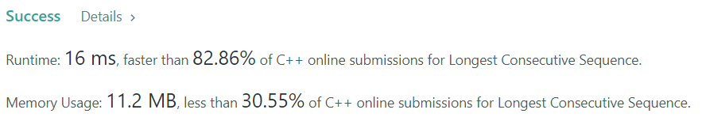

# 数据结构与算法I 实验10

**2019201409 于倬浩**


## 1.Number of Islands

给出一个01矩阵，求1构成的连通块个数。

考虑到今天上课讲了并查集，尽管这道题可以使用BFS/DFS等多种更简单且运行效率更高的做法，现在强行使用并查集来做。

将每个位置视为一个元素，初始没有元素相交。接下来扫描每个格子，如果和当前格子相邻的格子都是，就将两个格子代表的元素合并。这样，扫描完成一遍后，所有连通块内每个元素都在同一集合内。

统计答案也比较简单，首先初始状态下，每个位置对答案的贡献都是1，即“有多少个1初始就有多少个连通块”。接下来每次合并时，将答案减一，表示两个集合合并，当前的集合数量减少1，这样合并完成后我们就得到了集合的数量。

即使使用路径压缩+按秩合并，程序的运行时间依旧是$O(nm \times \alpha(nm))$，高于使用BFS/DFS的$O(nm)$时间复杂度，因此这道题使用并查集理论上运行效率更低，实际上常数因子也很大。

```c++
class Solution {
public:
    vector<int> fa; // 并查集数组
    int n, m;
    #define id(i, j) ((i) * m + (j))
    int find(int x) { // 路径压缩
        return fa[x] == x? fa[x] : (fa[x] = find(fa[x]));
    }
    int numIslands(vector<vector<char>>& grid) {
        int num = grid.size() * grid[0].size();
        n = grid.size(), m = grid[0].size();
        fa.clear();
        for(int i = 0; i < num; ++i) fa.push_back(i);
        int land = 0;
        for(int i = 0; i < n; ++i) {
            for(int j = 0; j < m; ++j) if(grid[i][j] == '1') { //扫描每个1
                ++land; //初始每个位置都有1的贡献
                if(i + 1 < n && grid[i + 1][j] == '1') {
                    int f1 = find(id(i, j)), f2 = find(id(i + 1, j));
                    if(f1 != f2){ //合并两个连通块，连通块数量-1
                        --land;
                        fa[f2] = f1;
                    }
                }
                if(j + 1 < m && grid[i][j + 1] == '1') {
                    int f1 = find(id(i, j)), f2 = find(id(i, j + 1));
                    if(f1 != f2){
                        --land;
                        fa[f2] = f1;
                    }
                }
            }
        }
        return land;
    }
};
```

提交记录：


## 2. Longest Consecutive Sequence

首先强行考虑使用并查集的思路。对值域维护并查集，初始将每个元素视为一个单元素集合，接下来尝试合并值域上相邻的元素即可。然而，题目中给出值域范围又很大（1e9），不可能对值域开一个数组，因此必须使用哈希表来代替数组。

到现在，算法的时间复杂度为$O(n\alpha(n) \times (1 + \alpha))$，其中第二个$\alpha$表示哈希表的装载因子，已经不是非常优秀了。

实际上，如果必须使用哈希表这一数据结构，再使用并查集就显得有些多此一举了。

我们只需要使用哈希表存储所有的$n$个元素。接下来，遍历哈希表中的每个元素。假设当前遍历到的元素为$x$，如果$x-1$在哈希表中不存在，就开始查找过程：每次判断$x+k$是否存在于哈希表中，如果存在就$k = k + 1$，否则当前一段的连续的值域区间长度即为$k$。如果$x-1$在哈希表中存在，那么直接跳过这个元素，因为每一个值域连续的段，我们只需要考虑一次。

这样，算法的时间复杂度即为$O(n\times(1 + \alpha))$，省去了并查集多余的一步，代码也简单得多。（实际上这些做法的常数因子都太大了，对于题目数据$n$只有$10^4$来说，`std::sort`跑的最快）。

```c++
class Solution {
public:
    unordered_set<int> st; //使用stl自带的哈希表
    int longestConsecutive(vector<int>& nums) {
        for(auto i:nums) st.insert(i); //将所有元素插入哈希表
        int ans = 0;
        for(auto i:st) if(!st.count(i - 1)) {
            //枚举每个连续段的开头
            int cur = i, num = 1;
            while(st.count(cur + 1)) ++cur, ++num;
            if(num > ans) ans = num;
        }
        return ans;
    }
};
```



当然为了完成实验要求，还是强行写了使用哈希表+并查集的代码：

```c++
class Solution {
public:
    unordered_map<int, int> mp;
    vector<int> fa, rk, sz;
    int n;
    int find(int x) {
        return x == fa[x] ? x : fa[x] = find(fa[x]);
    }
    inline void merge(int a, int b) { //按秩合并+路径压缩
        int f1 = find(a), f2 = find(b);
        if(f1 == f2) return;
        if(rk[f1] < rk[f2]) swap(f1, f2);
        fa[f2] = f1, sz[f1] += sz[f2];
        if(rk[f1] == rk[f2]) ++rk[f1];
    }
    int longestConsecutive(vector<int>& nums) {
        n = nums.size();
        fa.resize(n), sz.resize(n), rk.resize(n);
        for(int i = 0; i < n; ++i) {
            if(mp.count(nums[i])) continue; //处理重复元素
            mp[nums[i]] = i;
            fa[i] = i, sz[i] = 1, rk[i] = 0;
        }
        for(int i = 0; i < n; ++i) {
            if(mp[nums[i]] != i) continue; //处理重复元素
            if(mp.count(nums[i] - 1)) { //查看值域上相邻元素
                int t = mp[nums[i] - 1];
                merge(t, i);
            }
            if(mp.count(nums[i] + 1)) { //查看值域上相邻元素
                int t = mp[nums[i] + 1];
                merge(t, i);
            }
        }
        int ans = 0; //统计答案
        for(int i = 0; i < n; ++i) ans = ans < sz[i] ? sz[i] : ans;
        
        return ans;
    }
};
```


