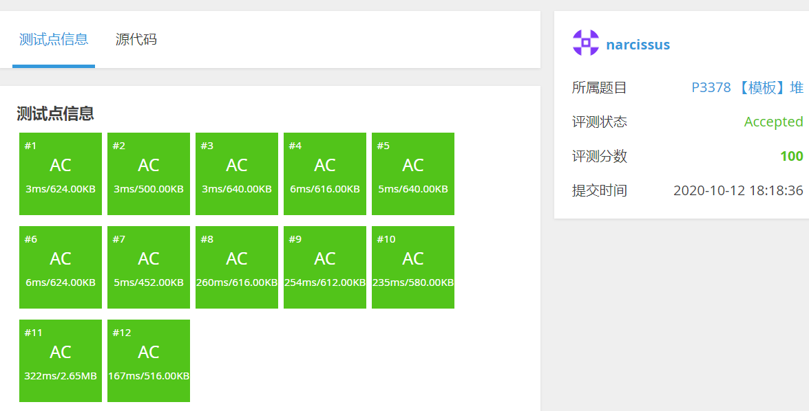
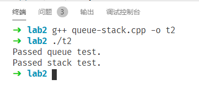
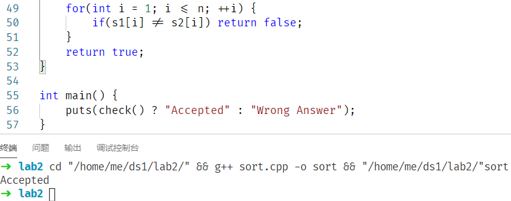

# 数据结构与算法I 实验2

**2019201409 于倬浩**

[toc]

## 一、题目

1. 实现最小优先队列的所有操作
2. CLRS 6.5-7（利用堆实现FIFO队列和LIFO栈）
3. 实现快速排序

## 二、算法思路

#### 1.实现最小优先队列的所有操作

​	本题中，优先队列的实现方式为最小二叉堆，需要实现的操作主要有加入元素(`push`)、弹出堆顶元素(`pop`)、读取最小元素(`top`)、维护子树的堆性质(`min_heapify`)以及减小某一下标元素的值(`decrease_key`)。

+ `push`：在数组最后加入目标元素，之后由于整个堆除了最后一个元素都满足堆性质，因此自底向上地调整元素，维护堆性质。
+ `pop`：交换堆顶和数组最后的元素，删去数组最后一个位置的元素，此时整个堆除了堆顶都满足堆性质，因此自上向下调整元素即可。
+ `top`：如果堆非空，直接返回下标为1的元素。
+ `min_heapify`：取左右儿子中值较小的，如果比当前节点值小，则与当前节点交换位置，然后进入子树递归进行。
+ `decrease_key`：在目标元素下标已知的情况下，可以减小目标元素的值，之后该节点到根路径上的点有可能不符合堆性质，因此自下向上调整元素，即可维护堆性质。
+ `make_heap`：对于一个无序数组，只需从第一个非叶节点对应的下标位置倒序枚举并执行`min_heapify`即可维护整个堆的性质。本质是按照子树大小枚举，维护每个子树的堆性质，类似“最优子结构”的感觉。

#### 2.CLRS 6.5-7（利用堆实现FIFO队列和LIFO栈）

​	在加入元素的时候，对于每个节点维护时间戳标记，利用自定义结构体重载的小于号(`<`)，定义元素的大小关系为时间戳的大小关系，利用上一题实现的最小堆即可完成操作。

​	对于FIFO，为了保证先进先出，只需让时间戳最小的元素在堆顶即可，定义元素间的小于关系为时间戳小于。

​	对于LIFO，为了保证后进先出，只需让时间戳最大的元素在堆顶即可，定义元素间的小于关系为时间戳大于。

​	这样实现出来的队列/栈只可用$\Theta(1)$代价取队列头/栈顶的元素，而不可以取到队列末尾元素。

#### 3.实现快速排序

​	实现快速排序的主要问题在于选取主元pivot的方法。为了保证时间复杂度尽可能不被极端数据退化到$\Theta(n^2)$，采用随机化选取主元的方法。实际上也可以采用C++ `std::sort`采用的`median-of-three`方法，然而为了减少边界情况的讨论（需保证长度大于等于3）同时保证随机性，此处仅使用了随机选取一个主元。如果生成三个位置取中位数，在大多数情况下可能因为产生随机数的效率不够高而导致常数因子反而升高。

​	实现sort时，另一个降低性能的因素是递归的使用。这里采用了CLRS提到的`Tail-Recursive`技巧，即将递归树上所有的右子树/左子树使用非递归的方式实现，另一子树再使用递归，这样可以减少一半的递归调用，而且不需要手动模拟栈，节省了模拟栈额外的空间花销，而且不会使编码复杂度上升。

​	生成随机数的方法采用了C++ `std::mt19937`，避免因为`rand()`的`RAND_MAX`在不同平台上的大小差异而产生的意外行为，然而这样的代价是生成随机数的常数因子更大。

​	快速排序的实际运行效率其实并不优秀，在区间较短时，时间复杂度$\Theta(n^2)$的插入排序反而表现更好。而当递归层数过深时，可能遇到了快速排序表现较差的数据，此时使用

## 三、程序设计框架

#### 1.实现最小优先队列的所有操作

堆的定义和实现均在`Heap.hpp`中，测试程序为`heap.cpp`

将堆封装至一个模板类中，并且比较元素时利用模板的小于号，因此对于自定义类，需要重载小于号才可以使用。

各种接口：

+ `void make_heap(vector<T> src)`
    + 从无序数组src中构建一个堆，时间复杂度$\Theta(n)$，空间复杂度$\Theta(n)$
+ `void push(T val)`
    + 插入值为val的元素，时间复杂度$\Theta(lgn)$，空间复杂度$\Theta (1)$
+ `void pop()`
    + 删除堆顶元素，时间复杂度$\Theta(lgn)$，空间复杂度$\Theta (1)$
+ `const T top()`
    + 返回堆顶元素，时间空间复杂度均为$\Theta (1)$
+ `void decrease_key(T key, int val)`
    + 将数组下标为key的元素值减少val，时间复杂度$\Theta(lgn)$，空间复杂度$\Theta (1)$
+ `T extract_min()`
    + 删除并返回堆顶元素，时间复杂度$\Theta(lgn)$，空间复杂度$\Theta (1)$

#### 2.CLRS 6.5-7（利用堆实现FIFO队列和LIFO栈）

队列和栈的定义和实现在`Queue.hpp`、`Stack.hpp`中，测试程序为`queue-stack.cpp`。

利用问题1中的模板类`Heap`，和自定义的含重载小于号的类`Queue_elem_t`、`Stack_elem_t`保存堆中元素，即可用优先队列实现FIFO、LIFO。

支持操作`push`、`pop`和`front`（对于队列）或`top`（对于栈）。

#### 3.实现快速排序

源文件对应文件夹中的`sort.cpp`

接口：`void mysort(T s[], int begin, int end)`，将数组s的区间[begin,end]按照类重载的小于号进行从小到大原址排序。

## 四、实验结果说明

#### 1.实现最小优先队列的所有操作

对于堆的基本操作，由于在线评测网站上已有对应题目，因此在网站上测试。

#### 2.CLRS 6.5-7（利用堆实现FIFO队列和LIFO栈）

由于评测网站上没有现成的队列/栈的评测，因此编写了文件夹内`heap-gen.cpp`用来生成操作序列，其中，操作格式如下：

+ `1 x`插入值为x的数
+ `2` 删除队首/栈顶元素 
+ `3` 输出队首/栈顶元素

使用`std::queue`和`std::stack`进行测试，比较操作3的输出结果即可，具体测试方法请见`heap.cpp`内的`check_queue()`和`check_stack()`，输出结果如下：

#### 3.实现快速排序

对于排序算法，验证正确性的方法是，随机生成一组数据，使用`std::sort`和自己实现的排序算法分别排序，然后比较每个位置元素是否相等。因此，文件夹中的`sort-gen.cpp`可以生成任意大小的随机数据，并写入文件夹中的`sort.txt`文件。在`sort.cpp`中，实现了一个检查正确性的函数`check()`，运行结果如下：

## 五、个人总结

对于前两个问题，主要关注点在于正确利用堆性质和维护堆性质，要分清进行操作后，被破坏的堆性质需要从底向上调整或是从上向下调整。程序实现上主要是利用非递归的框架，使用位运算优化寻找右儿子的过程。

对于第三个问题，其实大一秋学期的《高级程序设计I》已有涉猎，当时分析了C++ STL的`std::sort`的算法流程，学习了`IntroSort`这一算法，我也实现了一个多线程的内省排序，但当时关注点主要在于高效率程序的编写上，这学期的算法课，关注点主要在于时空效率的证明，以及CLRS上提到的median of 3还有Tail-Recursive优化方法的理论证明，感觉学习这些受益匪浅。