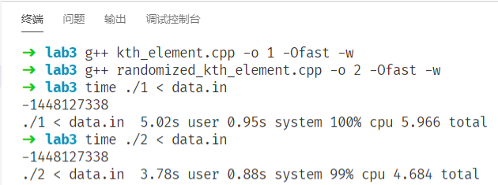

# 数据结构与算法I 实验3

**2019201409 于倬浩**

## 一、题目

1. 最坏情况下以线性时间选取第k大元素的算法；

2. Randomized-Select，并比较效率。

## 二、算法思路

1. 线性选择算法

    + 首先判断处理的区间长度是否小于140，如果满足条件，直接使用插入排序暴力排序后返回排名为k的元素。

        做到这里，很自然的想知道为什么在这里同样都是原址排序的$\Theta(n^2)$算法，为什么使用插入排序而不使用选择排序。

        我认为，使用插入排序主要是由于算法实际上在很多情况下并不会彻底进行内层的循环即可得到结果，即算法的常数因子较小，从而使其运行效率更高。

        然而，如果我们需要排序的单个元素占用空间较大，交换元素的代价较高，这时选择排序的优势就会显现出来，其元素交换次数仅为$\Theta(n)$，然而插入排序最坏需要$\Theta(n^2)$次交换。

    + 接下来将序列切成$\lfloor \frac{n}{5} \rfloor$段，对于每段分别插入排序后，取中位数并放到序列的最前部，然后再递归求序列前部元素的中位数(即Median of Medians)。

    + 得到了所求中位数，再调用快速排序的`partition`，将序列切分后，判断第k个元素出现在前半或是后半，最后递归下去即可。

2. 随机化选择算法
   
    + 大体思路和线性算法相似，只是`partition`时不再费力寻找Median of Medians作为pivot，而是随机选取一个元素作为pivot，然后直接将序列切分，判断排名为k的元素属于前半段或是后半段，然后进行递归即可。

## 三、程序设计框架

1. 线性选择算法
   
    见源文件`kth_element.cpp`

    函数原型为`template<class T> inline T kth_element(T a[], int L, int R, int k)`，可以返回数组a的下标`[L,R]`范围内的从小到大排名为k的元素，且最小元素排名为1。

    其中涉及到函数`int partition(T a[], int L, int R, T pivot)`可以在指定pivot的情况下，将区间`[L,R]`切分，并返回切分后pivot的下标。`void insertion_sort(T a[], int L, int R)`则是多次使用的插入排序函数。

2. 随机化选择算法

    见源文件`randomized_kth_element.cpp`。

    函数原型为`template<class T> T randomized_select(T a[], int L, int R, int k)`，各个参数含义与上一问的相同。

    涉及到的函数为`int randomized_partition(T a[], int L, int R)`与随机化快排的完全一致。

    为了保证跨平台可用，依然使用`std::mt19937`生成随机数，避免由于`RAND_MAX`不同导致不同平台下无法得到正确范围的随机数。

## 四、实验结果说明

正确性检验：使用目录内`data_generator.cpp`生成一个长度随机且元素随机的输入文件，使用两个程序分别运行同组输入，并与`stl_kth_test.cpp`的`std::nth_element`进行比较，发现结果一致，即可检验算法的正确性。

为了简便起见，使用目录内的`test.cpp`进行了100组测试检验，均可通过。

性能检验：使用`data_generator.cpp`生成一个长度为$10^8$的数组，内为$[-2*10^9,2*10^9]$的随机整数，使用Linux的`time`指令进行计时，测试结果如下：

发现尽管使用了同种优化的IO方式，输入时间仍有些许差异，然而两种算法本身的运行差异也比较明显，虽然都是线性，然而随机化的算法在随机数据下表现较为优秀，常数因子较小，运行时间略快。

## 五、个人心得

在实现`kth_element.cpp`时，我遇到了一个不是很明显却又很致命的bug。分段处理$\lfloor \frac{n}{5} \rfloor$个区间的中位数时，上界并不应该取到等号，否则在整除的情况下，会遍历到额外的部分，造成数组越界，因此编写程序时，一定要注意边界条件和容易忽略细节。