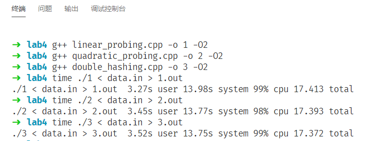
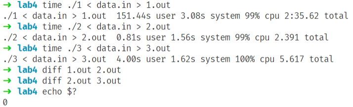

# 数据结构与算法I 实验4

**2019201409 于倬浩**

## 一、题目

1. Linear Probing
2. Quadratic Probing
3. Double Hashing

## 二、算法思路

1. Linear Probing
    + 插入k时首先找到$h(k)$对应位置，如果当前位置已经被占用则尝试下标相邻的下一个位置，直到找到空位或被打删除标记的位置后插入，当前位置的删除标记清空并存储新值，或遍历整个表一遍返回失败信息。
    + 删除k时首先找到$h(k)$对应位置，如果当前位置被占用且键值不为k则尝试下标相邻的下一个位置，或如果当前位置键值为k但是已被打上删除标记则尝试下一个位置，如果发现空位则返回未找到元素。如果成功找到键值为k且没有删除标记的位置，则打上删除标记。
    + 查询k时首先找到$h(k)$对应位置，接下来流程同删除操作，若找到位置则返回对应指针，否则返回空指针。
2. Quadratic Probing
    + 插入k时首先找到$h(k)$对应位置，如果当前位置$p$已经被占用且当前是第$i$次尝试，则下一个尝试的下标为$p'=(p + i) \mod \, M$，直到找到空位或被打删除标记的位置后插入，当前位置的删除标记清空并存储新值，或遍历整个表一遍返回失败信息。
    + 删除k时首先找到$h(k)$对应位置，如果当前位置被占用且键值不为k则尝试下一个位置（寻找下一个位置的方法同插入操作），或如果当前位置键值为k但是已被打上删除标记则尝试下一个位置，如果发现空位则返回未找到元素。如果成功找到键值为k且没有删除标记的位置，则打上删除标记。
    + 查询k时首先找到$h(k)$对应位置，接下来流程同删除操作，若找到位置则返回对应指针，否则返回空指针。
3. Double Hashing
    + 插入k时首先找到$h(k)$对应位置，并计算出另一散列函数值$h'(k)$，如果当前位置$p$已经被占用且当前是第$i$次尝试，则下一个尝试的下标为$p'=(p + h'(k)) \mod \, M$，直到找到空位或被打删除标记的位置后插入，当前位置的删除标记清空并存储新值，或遍历整个表一遍返回失败信息。
    + 删除k时首先找到$h(k)$对应位置，如果当前位置被占用且键值不为k则尝试下一个位置（寻找下一个位置的方法同插入操作），或如果当前位置键值为k但是已被打上删除标记则尝试下一个位置，如果发现空位则返回未找到元素。如果成功找到键值为k且没有删除标记的位置，则打上删除标记。
    + 查询k时首先找到$h(k)$对应位置，接下来流程同删除操作，若找到位置则返回对应指针，否则返回空指针。

## 三、程序框架

三个实现分别对应目录下的`linear_probing.cpp`，`quadratic_probing.cpp`和`double_hashing.cpp`。

哈希表的单个元素类：

```c++
struct data{
    bool deleted; //删除标记
    int key; //键值
    int val; //存储数据
    data() { 
        deleted = false;
        val = key = -1;
    }
    data(bool deleted, int key, int val) : deleted(deleted), key(key), val(val) {}
};
```

哈希表的定义：

```c++
struct hash_table{
    data s[M]; //数据
    inline void insert(int key, int val); //向键值为key的位置插入值为val的数据
    inline void erase(int key); //删除键值为key的数据
    inline data* find(int key); //返回指向键值为key的元素指针
};
```


## 四、运行结果

首先，随机生成$10^7$次插入、删除、查询操作，每次操作的元素值在int范围内随机(`gen.cpp`)，测试结果如下：



因为输入文件比较大(大致151MB)所以读入时间较长，在此只需比较用户时间。

可见在键值随机、哈希表的M较大且hash函数选取合理的情况下，碰撞概率本身较低，三者差别不是很大，但第二种在寻址时需要取模操作因此常数因子较大，第三种做法更需要计算两个hash值且需要每次取模，因此常数因子稍大。

为了体现后面算法的优势，构造了一些数据：共$10^6$次操作，每次涉及到的下标为`i`或`i+MOD`，即第一种算法每次都会发生碰撞（这种极端情况前提是构造数据的人知道哈希策略和模数），再次对比(`gen2.cpp`)。



可见第一种在这种数据下时间复杂度已经退化，后两种依旧高效，且第二种实际更快（猜测原因为第三种计算两次hash更费时间，且寻址上更低效）。正确性通过输出文件互相比较进行验证。