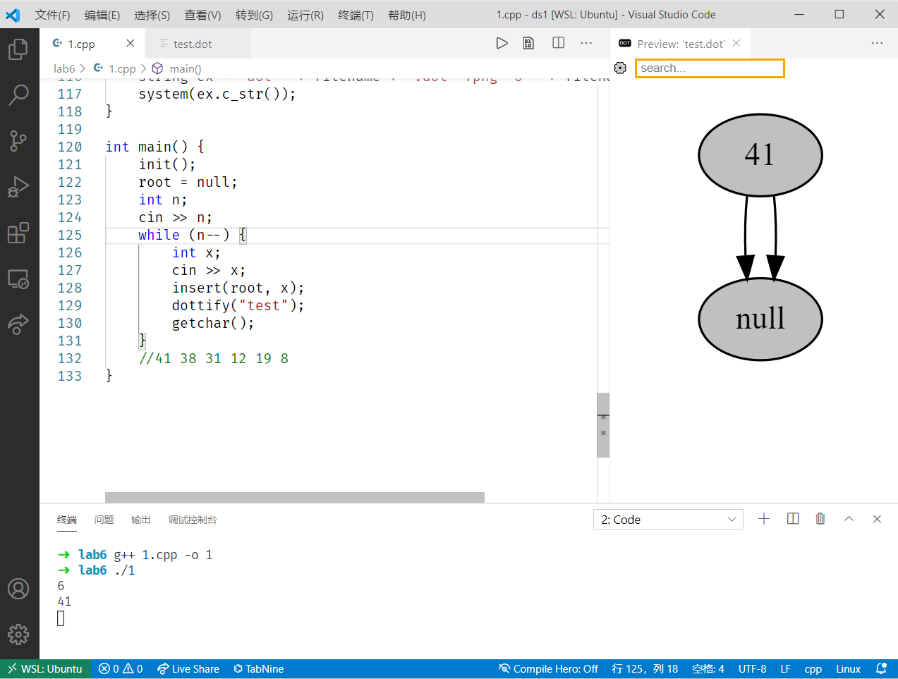
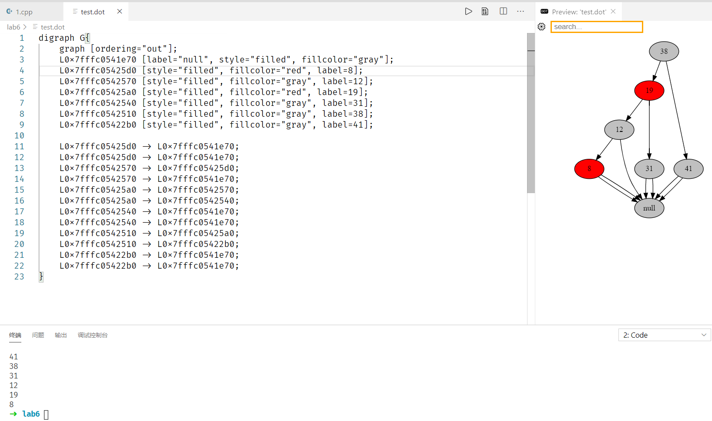

# 数据结构与算法I 实验6

**2019201409 于倬浩**

## 一、实验内容

+ 实现红黑树的插入操作

+ **扩展：大一下学期的《高级程序设计II》课程中，学到了使用`graphviz`进行数据可视化，于是实现了插入操作后，又实现了实时以图片方式展示树的结构。**


## 二、实现操作&接口

节点类定义如下：

```c++
struct node {
    node *c[2], *p;         //左右儿子、父亲节点
    int sz, val;            //当前节点子树大小、当前节点键值
    bool red;               //是否为红色节点
    inline void pushup() {  //维护当前节点信息
        if (this == null) return;
        sz = c[0]->sz + c[1]->sz + 1;
    }
};
```

对于rotate和fixup的实现，由于节点类内使用0/1区分左右儿子，因此实际上左右旋转可以重用一段代码，rotate(x,0)表示左旋，1表示右旋即可。这样实现rotate后，在fixup部分内也可以重用同一段代码，避免冗余。具体实现和CLRS上的伪代码保持一致。

核心操作：rotate、fixup，其余操作和普通二叉搜索树一致，具体见代码。

```c++
inline void rotate(node *x, bool d) {  //d=0 left, d=1 right
    node *y = x->c[d ^ 1]; //左旋取右儿子，右旋取左儿子
    if (y->c[d] != null) y->c[d]->p = x; //把右儿子的左儿子/左儿子的右儿子换成当前节点的儿子
    if (x->p == null) //维护父亲节点的信息或是root指针的信息
        root = y;
    else
        x->p->c[isrc(x)] = y;
    y->p = x->p, x->p = y; //修改当前节点、儿子的信息
    x->c[d ^ 1] = y->c[d], y->c[d] = x;
    x->pushup(), y->pushup();
}

inline void rb_insert_fixup(node *z) {
    while (z->p->red) { //由于之前一致符合红黑树性质，因此只需维护到不出现连续的红色节点即可
        int d = isrc(z->p); //找出父亲和叔叔
        node *uncle = z->p->p->c[d ^ 1], *father = z->p;
        if (uncle->red) { //叔叔和父亲都是红色，直接反色，把爷爷设成红色，保持黑高不变。
            father->red = uncle->red = false;
            father->p->red = true;
            z = father->p;
        } else {
            if (isrc(z) ^ d) {//如果当前节点和父亲不构成“直链”，先旋转成直链
                z = z->p;
                rotate(z, d);
            }
            z->p->red = false; //将直链顶部的两个节点反色，之后旋转去掉直链，保证平衡
            z->p->p->red = true;
            rotate(z->p->p, d ^ 1);
        }
    }
    root->red = 0;
}
```


## 三、测试&可视化

测试思路很简单，每次插入后，将树的结构输出到`graphviz`的`.dot`格式，并调用`graphviz`实时渲染图像，或使用`VS Code`自带的实时预览插件。

输出`.dot`的过程也很简单，为了使用简单的方法使得输出的有向图看起来有二叉树的结构，需要固定节点相对顺序然后按照`DFS`中序，逐个输出。接下来只需要输出边即可。

算法导论`13.3-2`要求展示插入`41 38 31 12 19 8`后树的形态，那么我们就用这个数据进行测试。

首先输入节点总数n，接下来输入第一个键值`41`，结果如下图：



接下来，逐个插入键值，每次新的树形态如下：


程序运行结束后，最终的`.dot`和输出的图像如下：



使用方法：本机环境为WSL Ubuntu，使用apt安装`graphviz`软件包后，编译运行`rb_tree_visualization.cpp`即可。首先输入插入的节点数目，接下来一行一个整数表示插入的节点。如果在`VS Code`环境下，还可以使用`Graphviz Interactive Preview`插件实现实时预览。即使不使用插件，每次插入后，都可以查看目录下的`test.png`，效果和使用插件相同。

## 四、个人感受

一开始想做可视化，实际上是因为想看每次插入后红黑树的真实形态，高中时简单粗暴的输出节点和边的方法就显得非常不直观，联想到上学期学到的这个小trick，发现用起来效果意外地非常好，使用起来也很好玩。