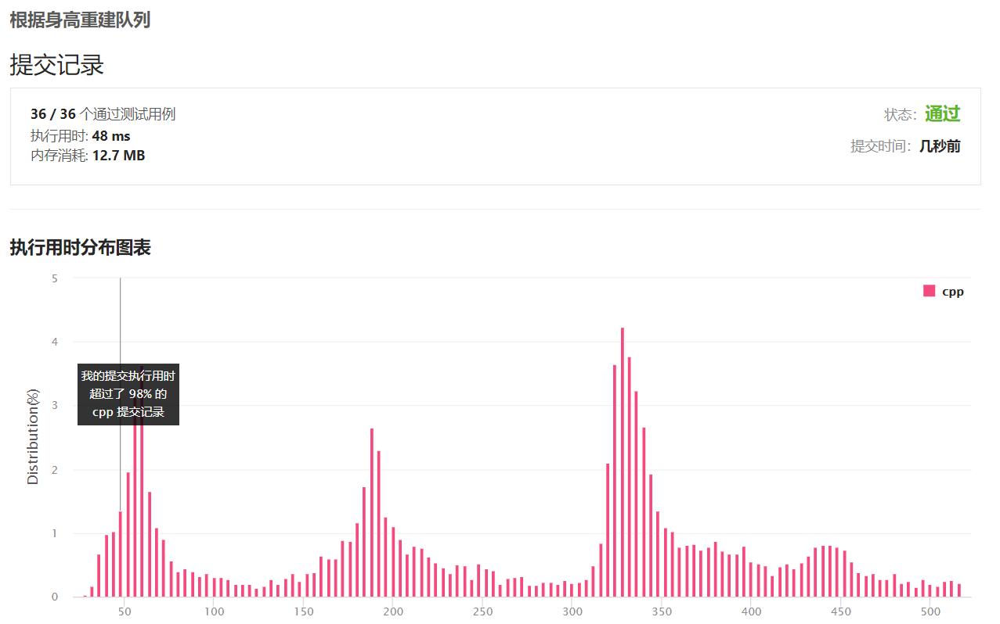
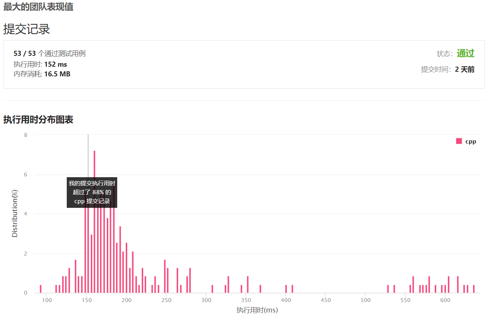

# 数据结构与算法I 实验7

**2019201409 于倬浩**

[toc]
## 一、根据身高重建队列

### 1.1题目描述

给出一个长度为$n$的数组，每个元素为二元组$(h_i, k_i)$表示第$i$个人的身高为$h_i$且希望在重建后的数组中，位置比这个人的位置小，且身高不小于这个人的人数恰为$k_i$，要求满足所有人的要求重建一个新的数组。

**输入保证一定存在一组合法构造。**

### 1.2算法设计

将所有人按照$h_i$递减排序，对于高度相同的人，按照$k_i$递增顺序排序。

接下来，对排好序的数组进行顺序扫描，如果第$i$个人（从0开始）的$k_i < i$，那么就把这个人插入到第$k_i$个位置，后面的人依次向后平移一个位置。扫描完成后的数组即为最终结果。

排序操作的时间复杂度为$\Theta(nlgn)$，将数组的某个元素前移的单次时间复杂度为$\Theta(n)$，因此总时间复杂度为$\Theta(n^2)$，空间复杂度$\Theta(nlgn)$。

实际上可以直接算出来每个节点最终所在的位置，但是还存在另一种使用数据结构的优化方式：使用一颗二叉平衡树维护整个序列。使用可持久化$Treap$作为平衡树，可以做到$\Theta(lgn)$将某个节点插入到当前序列中指定下标的位置，并且最后使用$\Theta(n)$的时间还原出整个序列。因此，优化后的时间复杂度为$\Theta(nlgn)$，空间复杂度$\Theta(n)$。

### 1.3算法证明

由于保证了一定存在合法的构造，那么身高最高的人（假设有p个身高最大的人）的$k_i$一定构成了一个$0$到$p-1$的排列，否则显然无法构造出合法的解。而对于这些人，唯一合法的方案就是按照$k_i$从小到大排序，否则一定不能满足所有人的要求。实际上，对于身高相同的人，都可以按照这种方法处理，但是并不要求每个身高相同的人都要在序列中相邻，只要保证相对顺序满足要求即可。形式化地表述为：假设身高为$h_t$的人有$p$个，按照$k_i$从小到大排序后重标号为$0$到$p-1$，那么这些人在重构数组中的下标只需满足$\forall{i < j},  pos(i) < pos(j)$即可。

接下来，只需考虑身高不同的人。假设我们现在已经得到了前$i-1$人的构造结果且满足要求，那么考虑第$i$个人。如果将$i$前移，那么并不会导致前$i-1$个元素不符合要求，因为我们已经通过排序确保前$i-1$人大于等于当前身高。接下来，由于第$i$个人要求前面恰好有$k_i$个人身高大于等于$h_i$，而前面$i-1$个人每个人的身高都大于等于$h_i$，因此只有一种合法方案可以满足当前要求：将这个人移动到序列下标为$k_i$的位置（0~$k_{i}-1$共$k_i$个人）。因此，如果已经有前$i-1$个人的合法构造方案，那么通过此方法一定可以构造出前$i$个人的合法构造方案。通过归纳法可知，这样的构造方法就可以构造出全局的最优方案。这样贪心构造的正确性也就得到了证明。

### 1.4代码实现

由于可持久化$Treap$的实现过长，限于篇幅，此处只贴出核心函数的实现及思路，完整代码见目录下`1.cpp​`

```c++
vector<vector<int>> reconstructQueue(vector<vector<int>>& people) {
    vector<Data> ppl; //Data是为了减少vector复制开销，重新实现的数据类
    ppl.resize(people.size());
    for(int i = 0; i < ppl.size(); ++i)
        ppl[i].v = people[i][0], ppl[i].r = people[i][1];
    sort(ppl.begin(), ppl.end()); //按照前述规则进行排序
    treap_init();
    for(int i = 0; i < ppl.size(); ++i)
        insert(ppl[i].r, ppl[i]); //Treap插入节点操作，复杂度O(lgn)
    dfs(root, people);
    return people;
}
```




## 二、最大的团队表现值

### 2.1题目描述

公司有编号为$1$~$n$的$n$个工程师，每个工程师有速度$speed_i$和效率$efficiency_i$两个参数。

求最多由$k$个工程师构成的最大团队表现值。

团队表现值定义为每个人的速度之和乘以最小效率。

### 2.2算法设计

首先将每个人按照效率递减顺序排序。

维护一个小根堆以及堆中元素的和`sum`，初始为堆空，$sum=0$。

顺序扫描每个人，如果当前堆中元素数量为$k$，弹出堆顶并从$sum$中减去。

之后将当前人的速度$speed_i$加入堆，$sum = sum + speed_i$，那么只用效率大于等于$efficiency_i$的工程师的答案即为$efficiency_i * sum$，全局的答案即为当前局部的最大值。

最多有$\Theta(n)$次入堆、出堆操作，因此使用二叉堆的时间复杂度为$\Theta(nlgn)$，空间复杂度为$\Theta(n)$。另外，排序操作的时间复杂度为$\Theta(nlgn)$，因此该算法的总时间复杂度为$\Theta(nlgn)$，空间复杂度为$\Theta(n)$。

### 2.3算法证明

首先考虑暴力枚举最小的效率值x，那么所有效率值大于x的工程师都可以被选择，那么接下来的问题变成了，在一个整数集合中，选出至多`k`个使得和最大。显然这个问题可以通过贪心的取最大的`k`个元素来解决。任何其他方案都可以通过调整为最小的没有被选择的且排名小于等于k的元素，来使得方案变得更优秀，因此贪心的正确性得证。

为了优化这个暴力，我们可以首先将每个人按照效率值递减排序，然后顺序枚举每个人$i$，显然前$i-1$人的效率值都更大，因此$i$就是当前集合中效率最低的。只需使用堆动态维护前$i$个人的速度即可，每次从团队中踢出速度最低的，更新答案即可做到对暴力算法的优化。

### 2.4代码实现

```c++
class Solution {// Leetcode 1383
public:
    struct data {
        int s, e;
        inline bool operator < (const data &b) const { 
            return e > b.e;
        }
    };
    int maxPerformance(int n, vector<int>& speed, vector<int>& efficiency, int k) {
        vector<data> d;
        priority_queue<int, vector<int>, greater<int>> pq;
        for(int i = 0; i < n; ++i) 
            d.push_back((data){speed[i], efficiency[i]});
        sort(d.begin(), d.end());
        long long ans = 0, curs = 0;
        int csz = 0;
        for(int i = 0; i < n; ++i) {
            if(csz == k) {
                int c = pq.top();
                curs -= c;
                pq.pop(), --csz;
            }
            pq.push(d[i].s), curs += d[i].s, ++csz;
            ans = max(ans, curs * d[i].e);
        }
        return ans % 1000000007;
    }
};
```


